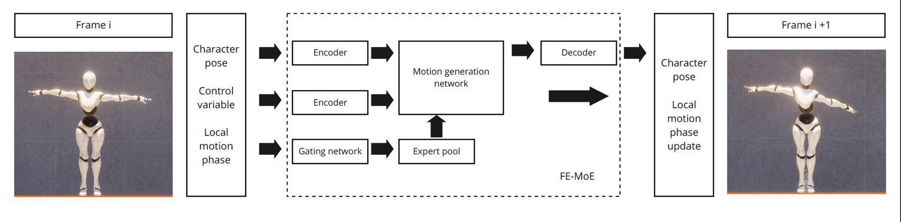
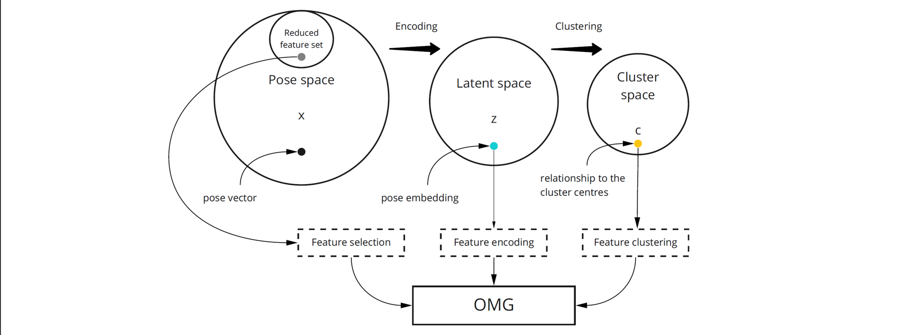

# Deep learning-based rig-agnostic encoding
This is my master thesis project about studying transfer learning for data-driven motion generation frameworks.
All necessary code for producing the results described in the thesis are provided here, but it is not very organized and poorly maintained. 

**Objective-driven motion generation model architecture**

**Rig-agnostic encoding approaches**

## Demo
### Transferred FE-OMG 
The white character is the target animation. Blue is the generated animation from the vanilla OMG model with limited training and data. Red is from the warm-started OMG model with parameters from a pre-trained model that was previously trained on another rig. In this case, only the autoencoders are being optimized. Green is the same as the red one but the whole model is allowed to be optimized.

### Transferred FS-OMG 
In this case, the pose inputs to the OMG models only contain information about 6 key-joints (hands, feet, head and pelvis). OMG model is responsible to not only predict the next pose but also upscale it to the full resolution pose.

## Contents
1. [ Jupyter Notebooks ]( src/notebooks ) - contains the notebooks for computing the results (assuming the models are trained and available) and plotting the graphs
2. [ MLP with adversarial net ]( src/autoencoder/MLP_Adversarial.py ) - is the default Autoencoder (3-layer MLP) + an adversarial Conv-LSGAN model for providing the adversarial error of the generated poses.
3. [ Clustering models ]( src/clustering_modes ) - contains four variants of AE with an extra layer between the encoder and decoder for performing the clustering on the embeddings
4. [ Experiments ]( src/experiments ) - contains code for training, validating and testing the various models
5. [ func ]( src/func ) - contains miscellanenous functions for extracting, preparing data
6. [ motion_generation_models ]( src/motion_generation_models ) - contains the various OMG models and MoGenNet

